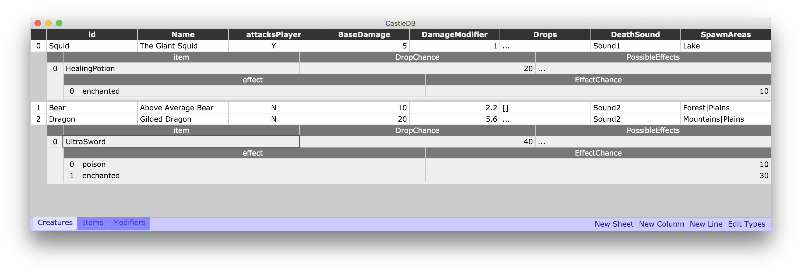
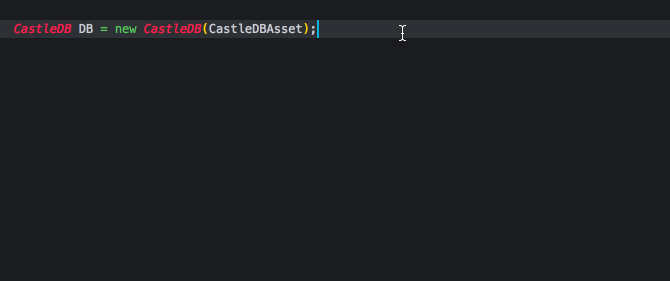

# CastleDB Unity Importer
*Requires Unity 2018 + Scripting Runtime 4.X*  
Define all your data in CastleDB and then directly access your data in code in Unity with full intellisense support!

Made in part as a database tool for [Cantata](https://www.cantata-game.com).

## General Information

### Getting Started
Construct some data in CastleDB:


Import the repo's [.unitypackage release](https://github.com/kkukshtel/castledb-unity-importer/releases) into Unity (or open the repo project directly), and then add your .cdb file somewhere in your Assets directory. Unity will import the .cdb file and generate it's classes.

Open your code editor, and access your data like this:
```c#
// Inspector reference to imported asset
public TextAsset CastleDBAsset;
...
// Somewhere else inside your code
CastleDB DB = new CastleDB(CastleDBAsset);
Creature dragon = DB.Creatures.Dragon;
```

Sheets get converted into types that allow you to strongly reference your data.
```c#
// Get the Dragon from the Creatures sheet and get some of its properties
CastleDB DB = new CastleDB(CastleDBAsset);
Creature dragon = DB.Creatures.Dragon;
string dragonName = dragon.Name;
Creature.DeathSoundEnum = dragon.DeathSound;
// You can also easily access nested items:
// In this example, we get the first Drop from a Dragon and get that Drop's first possible Effect.
Effect effect = DB.Creatures.Dragon.Drops[0].PossibleEffects[0];
string effectName = effect.name;
int effectChange = effect.change;
```

The types update as you update your database schema.

### Possible Uses
This plugin was built as a way to seperate core game data from Unity, as was the intention with CastleDB's intended Haxe use case. This means that you can move almost any static data into CastleDB and remove the need to keep track of it in code.

Possible uses include:
* Item Tables
* Unit Stats
* Descriptions/Lore
* Translations
* Spawn information
* Asset loading info
* Etc.

Basically, anytime you have a large list of _things_ you need to have in your game, you can just make a sheet in CastleDB and then access that data inside Unity from this integration.

Another benefit is that the .cdb file is just JSON, meaning it versions well in source control, so tracking data changes is much easier.

---

## Extended Information
Read on for a deeper dive on how to use this plugin as well as information about CastleDB and this plugin in general.

### What is CastleDB?
_From the [CastleDB](http://castledb.org/) site:_  
CastleDB is used to input structured static data. Everything that is usually stored in XML or JSON files can be stored and modified with CastleDB instead.

### Why this Plugin?
*[Read my blog post about this here]()*  
Unity doesn't provide an easy way to globally manage game data, so this plugin is an attempt to fix that. CastleDB was built for this explicit purpose, but until now has only had an easy interop with games made in Haxe. This plugin is meant to provide Unity developers with not only CastleDB support but also the ability to use the database like the original Haxe API. This means allowing the developer to strongly reference data values in code by type, without having to roll their own data interpretation layer.

### Full Plugin Guide
To use this plugin, download and import the latest Unity package from [the releases page](https://github.com/kkukshtel/castledb-unity-importer/releases). This repo can also directly be opened as a Unity project file and includes a sample CastleDB (.cdb) file.

If you want to work with the sample file further or create your own data, [download and install CastleDB from here](http://castledb.org/).

If you are opening this repo as a project, you will see the Assets/TestFolder/GeneratedTypes folder by default (complete with generated code from the provided .cdb file).

If you are importing the package into an existing Unity project, you'll need to import or create a .cdb file for those default folders to generate. If you're just getting started, I recommend using the .cdb file in this repo.

When you add a .cdb file to your Unity project with this plugin, this plugin uses Unity's ScriptedImporter API to tie into the import process and generate code based on the contents of the .cdb file. **Any time you make a change or reimport your .cdb file, this code will be auto-generated**. 

Once the code is generated, reload your solution and then get to working with your data!



If you're using the repo, you can open up the Test.scene file and click the "Test" checkbox on the TestObject object (works in edit mode as well) and verify that the console prints out the proper values from the .cdb file.

Because this plugin does code generation, it's important to understand what is happening and structure your database accordingly. The main concepts employed are:
* A **sheet** is considered a **Type**
* A **column** in a sheet is considered the sheet's **fields**
* A **row** in a sheet is considered an **instance** of the sheet's Type.

Try adding in new sheets/rows/columns via CastleDB to the default provided CastleDB file to get a feel for how the code generation works. Also be sure to check out the Limitations section below for some general guidelines on how to use CastleDB with Unity.

### Config File
A config file is provided in the .unitypackage and repo that allows you to define the general behavior of the code generation by allowing you to set custom values for three diffferent fields:
* **GUIDColumnName** is the name of the column you use in each sheet to define how you want the item to be accessed. I recommend you just make this be "id" and make it a string type. See the included .cdb file for an example.
* **GeneratedTypesLocation** is the folder, relative to Assets, that you want to put the generated types in. I.e. a location of "Cool Stuff/Generated Types" would put the types in Assets/Cool Stuff/Generated Types.
* **GeneratedTypesNamespace** is the namespace you want to use for the types you generate. This is important because you'll need to use this namespace to access the types you generated. Ideally you have a project namespace you already use and you can just set this value to that so you don't need any additional using statements.

### Additional API
The generated CastleDB file provides a ```.GetAll()``` function for any defined sheet type. This is useful if you just want to grab all of a given Class' instances instead of needing to reference them one by one.

### Limitations  
While this plugin covers the general use cases of CastleDB, the fact it was not meant to be used in Unity means there are some limitations to using this plugin.    

**All sheets need to have a GUID column that defines the name of a row**  
This defaults to "id" with a "Unique Identifier" type. Note that this doesn't apply to list types, only "top-level" sheets.  

**You can only have one .cdb file in your project**  
If you find the need to use another .cdb file, you can very likely just use another sheet in your preexisting .cdb file.  

**Objects are created when requested and do not share direct internal references**  
This means that if you have two Creatures and they both reference a Location called Mountain, and you create those two creatures, the Location field of the creatures will point to different instances of Mountain (as each creature creates its own Mountain during retrieval).  
* NOTE: This was a major design decision that I'm still on the fence about. If you have thoughts or ideas here I would love to hear them!  

**Circular references of any kind will likely break object creation**  
Don't make a row in a sheet (Sheet A) with a reference type column that points to a row in another sheet (Sheet B) with a reference type column that points to a row in the first sheet (Sheet A) or you will likely crash your application.  

**If you add more columns or rows to a given type, the solution in Unity will properly update but you're need to reload your solution in your editor**  
This manifests as previous mentions of your type in code saying "Can't be found". To fix this, just reload the assembly in your editor. In VSCode, this is as easy as just clicking your .sln file at the bottom of the window and reselecting it.  
* If anyone has ideas about how to automatically reload the solution, let me know!  

**There is no validation of column names, so column names in CastleDB need to be valid C# field names**  
I.E. don't use spaces in your column names, weird characters, etc. *This also applies to text in your GUID column* because these names become strongly typed. Because of this, make your GUID name something easy to remember/use, and have an additional text column that is the actual name of your row.  

### TODO  
While this repo is ready to be used for general purpose cases, there is still some work to be done! Happy to accept any pull requests that tackle these issues.
* Add in CastleDB Color support.
* Convert all the generated string concatentation to use StringBuilder.
* Figure out a better guide for adding CastleDB Custom Types.
* Document way to add in your own CustomType to match with a predefined Type in Unity.
* Currently do not have file types or Image types implemented. This would require some preconfiguration steps that seem unique to every user so I'm not sure if it should be added.
* CastleDB also has a map/level creator that is not used at all here. Could be interesting to implement.

### References
Here's a list of resources that made a lot of this possible.

First off, this plugin could not have been possible without [SimpleJSON](http://wiki.unity3d.com/index.php/SimpleJSON). Thanks to all those who worked on this great library!

[CastleDB Wedbsite](http://castledb.org/) and [Repo](https://github.com/ncannasse/castle)  
[Best CastleDB Tutorial/Walkthrough](https://translate.google.com/translate?sl=auto&tl=en&js=y&prev=_t&hl=en&ie=UTF-8&u=http%3A%2F%2Fhaxeflixel.2dgames.jp%2Findex.php%3FCastleDB%252FHaxe&edit-text=)  
[Unity ScriptedImporter Docs](https://docs.unity3d.com/Manual/ScriptedImporters.html)  
[Game From Scratch's CastleDB Overview](http://www.gamefromscratch.com/post/2015/11/14/CastleDB-A-Game-Database-A-Level-Editor-Its-Both.aspx)